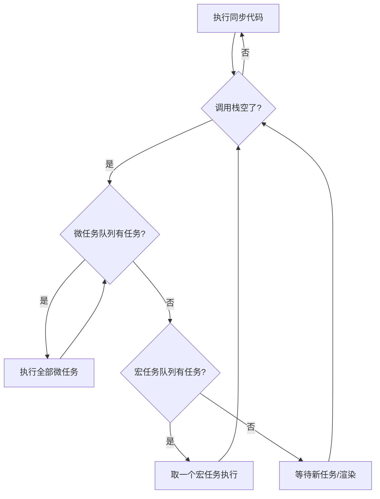
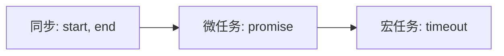
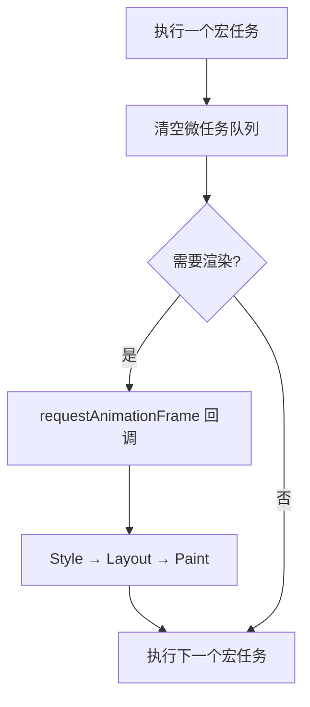

## 为什么 JavaScript 是单线程的

JavaScript 最初是为浏览器设计的脚本语言，核心任务是操作 DOM。如果有两个线程同时修改同一个 DOM 节点，浏览器就不知道该听谁的。所以 JS 从诞生起就是**单线程**——同一时间只能做一件事。

但单线程带来一个问题：如果网络请求要等 3 秒，难道页面就卡死 3 秒？于是有了**异步**和**事件循环**。

## 事件循环到底是什么

一句话：**JS 引擎不断检查"主线程空了没，空了就去任务队列里拿下一个任务执行"的循环机制。**



关键规则：

| 概念 | 说明 |
|------|------|
| 调用栈（Call Stack） | 当前正在执行的代码，先进后出 |
| 宏任务（Macro Task） | `setTimeout`、`setInterval`、I/O、UI 渲染 |
| 微任务（Micro Task） | `Promise.then`、`MutationObserver`、`queueMicrotask` |
| 执行优先级 | 同步 > 微任务 > 宏任务 |

## Promise 的执行时机

Promise 本身是**同步**的，只有 `.then` / `.catch` / `.finally` 里的回调是**微任务**。

```js
console.log('1'); // 同步

const p = new Promise((resolve) => {
  console.log('2'); // 同步！executor 立即执行
  resolve('done');
});

p.then((val) => {
  console.log('3'); // 微任务
});

console.log('4'); // 同步
```

输出顺序：`1 → 2 → 4 → 3`

解释：
- `1`、`2`、`4` 是同步代码，按顺序执行
- `resolve('done')` 把 `.then` 的回调丢进微任务队列
- 同步代码全部跑完，调用栈清空，才去微任务队列取 `3` 执行

## 经典面试题：setTimeout vs Promise

```js
console.log('start');

setTimeout(() => {
  console.log('timeout');
}, 0);

Promise.resolve().then(() => {
  console.log('promise');
});

console.log('end');
```

输出：`start → end → promise → timeout`

为什么？



`setTimeout` 再短也是宏任务，优先级永远低于微任务。

## 进阶：async/await 本质

`async/await` 只是 Promise 的语法糖：

```js
async function foo() {
  console.log('A');
  await bar();
  console.log('B'); // 相当于 .then 里的回调
}

function bar() {
  return Promise.resolve();
}

console.log('C');
foo();
console.log('D');
```

输出：`C → A → D → B`

`await` 后面的代码相当于被放进了微任务队列。`foo()` 调用本身是同步的（所以 `A` 立即打印），但 `await` 之后的 `B` 要等当前同步代码跑完。

## 地狱难度：嵌套微任务

```js
Promise.resolve().then(() => {
  console.log('1');
  Promise.resolve().then(() => {
    console.log('2');
  });
});

Promise.resolve().then(() => {
  console.log('3');
});
```

输出：`1 → 3 → 2`

关键点：**微任务队列里新产生的微任务，要等当前一轮微任务全部执行完才轮到。**

执行过程：
1. 第一轮微任务：`then1`（打印 1，产生新微任务）和 `then2`（打印 3）
2. 第二轮微任务：打印 2

## 事件循环与浏览器渲染

一个完整的循环：



这意味着：
- 微任务在**渲染之前**执行 → 在微任务里改 DOM，用户看不到中间状态
- `requestAnimationFrame` 在**渲染之前、微任务之后** → 适合做动画
- `setTimeout` 在**下一轮**才执行 → 可能掉帧

## 面试回答模板

> "JS 是单线程的，通过事件循环处理异步。执行顺序是：先跑完所有同步代码，然后清空微任务队列（Promise.then、MutationObserver），最后取一个宏任务（setTimeout、I/O）。微任务里新产生的微任务会在当前轮次继续清空，不会等到下一轮。async/await 本质是 Promise 语法糖，await 后面的代码相当于 .then 回调，是微任务。"

## 总结

| 代码类型 | 执行时机 | 例子 |
|----------|----------|------|
| 同步代码 | 立即执行 | `console.log`、变量赋值 |
| 微任务 | 同步代码跑完后，渲染前 | `Promise.then`、`await` 后续、`queueMicrotask` |
| 宏任务 | 下一轮事件循环 | `setTimeout`、`setInterval`、I/O |
| rAF | 微任务之后、渲染之前 | `requestAnimationFrame` |

记住一句话就够了：**同步先行，微任务插队，宏任务排最后。**
